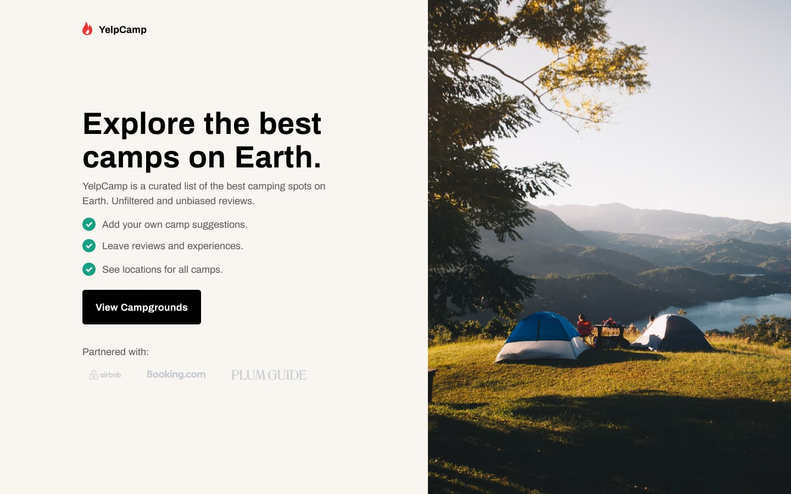
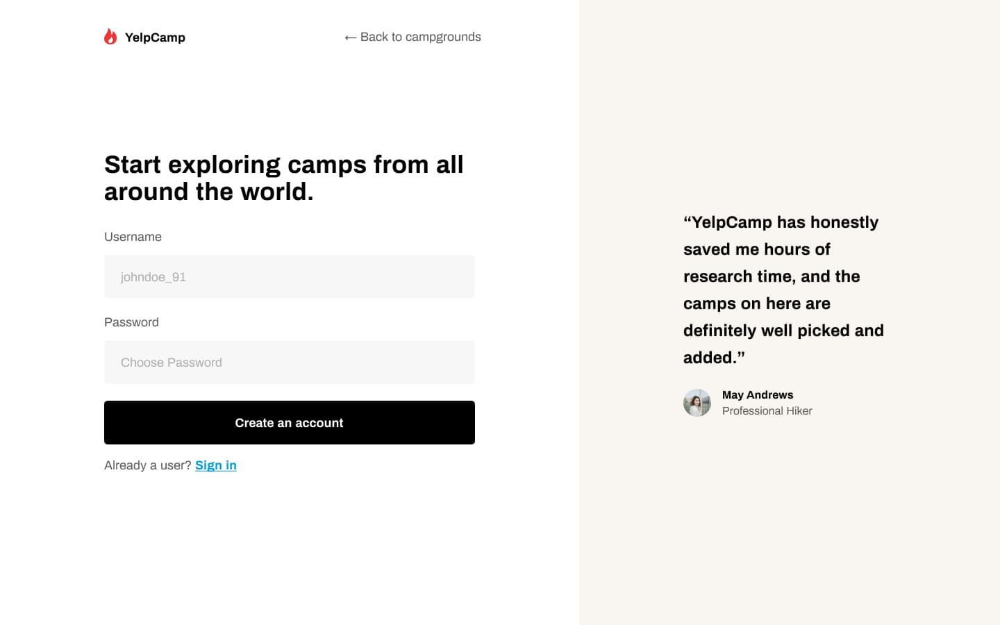

# Sobre o projeto [🇧🇷]

## YelpCamp - explore os melhores acampamentos do planeta.

YelpCamp é uma plataforma online que lista os melhores locais para acampar do mundo, tendo como base avaliações não filtradas e imparciais de milhares de pessoas apaixonadas por esse tipo de atividade. 

No YelpCamp você pode:
- Adicionar suas sugetões de acampamentos
- Deixar comentários e relatar suas experências
- Encontrar novos locais para novas aventuras

# About the project [🇺🇸]

## YelpCamp - explore the best camps on the planet.

YelpCamp is an online platform that lists the best camping sites in the world, based on unfiltered and unbiased reviews from thousands of people passionate about this type of activity.

At YelpCamp you can:
- Add your camping suggestions
- Leave comments and report your experiences
- Find new locations for new adventures

# Screenshots

### Lading page

### Sign Up page

## 👽 about me:
- Instagram - [@naiandersonbruno_](https://www.instagram.com/naiandersonbruno_/)
- Linkedin - [Naianderson Bruno](www.linkedin.com/in/naianderson-bruno-franca)